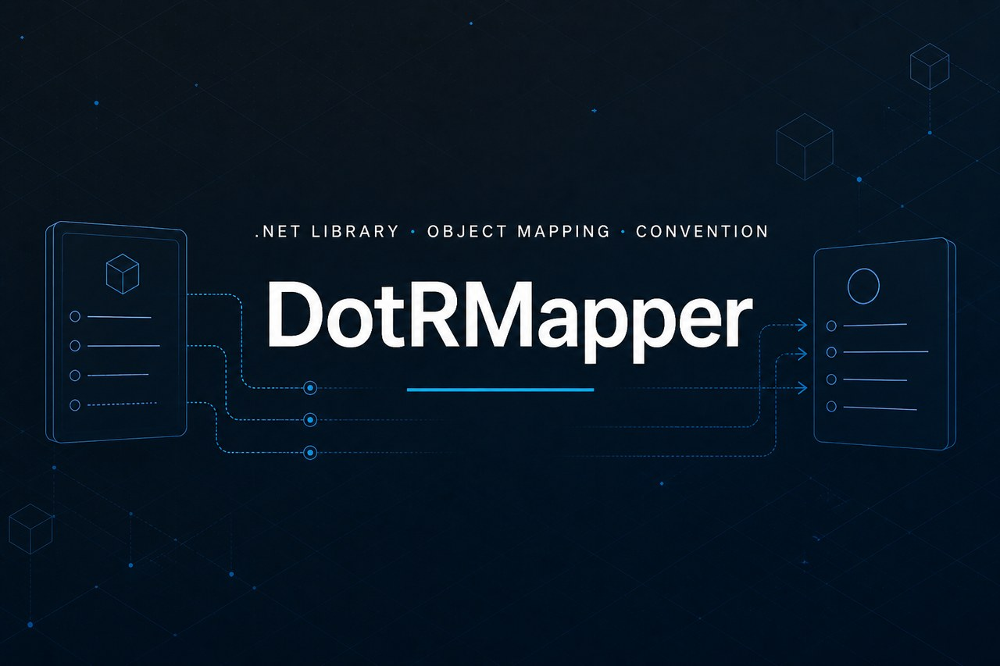

<p align="center">
  
</p>

# DotRMapper

[](https://dotnet.microsoft.com/)
[](LICENSE)

**DotRMapper** is a convention-based object-to-object mapper for .NET. It eliminates repetitive mapping code by automatically copying properties between types and providing a fluent API for custom transformations — similar to [AutoMapper](https://automapper.org/).

---

## Table of Contents

- [Features](#features)
- [Installation](#installation)
- [Quick Start](#quick-start)
- [Documentation](#documentation)
- [Running Tests](#running-tests)
- [Project Structure](#project-structure)
- [License](#license)

---

## Features

| Feature | Description |
|---------|-------------|
| **Convention-based mapping** | Automatically maps properties with matching names (case-insensitive) |
| **Fluent configuration** | Customize individual members with `ForMember` |
| **Profiles** | Group related mappings into reusable `Profile` classes |
| **Reverse mappings** | Generate inverse mappings with `ReverseMap()` |
| **Collection mapping** | Maps arrays, lists, and `IEnumerable<T>` |
| **Nested object mapping** | Recursively maps complex object graphs |
| **Custom resolvers** | Plug in `IValueResolver` implementations |
| **Type converters** | Transform values with `ITypeConverter` |
| **Before/After hooks** | Run callbacks before or after mapping |
| **Configuration validation** | Detect unmapped members with `AssertConfigurationIsValid()` |

---

## Installation

Add a project reference to the library:

```bash
dotnet add reference path/to/DotRMapper/DotRMapper.csproj
```

Or, once published to NuGet:

```bash
dotnet add package DotRMapper
```

**Requirements:** .NET 8.0 or later.

---

## Quick Start

### 1. Define your types

```csharp
public class Source
{
    public int Id { get; set; }
    public string FirstName { get; set; } = string.Empty;
    public string LastName { get; set; } = string.Empty;
}

public class Destination
{
    public int Id { get; set; }
    public string FirstName { get; set; } = string.Empty;
    public string LastName { get; set; } = string.Empty;
    public string FullName { get; set; } = string.Empty;
}
```

### 2. Configure the mapper

```csharp
using DotRMapper;
using DotRMapper.Abstractions.Configuration;

var config = new MapperConfiguration(cfg =>
{
    cfg.CreateMap<Source, Destination>()
        .ForMember(dest => dest.FullName, opt => opt.MapFrom(src => $"{src.FirstName} {src.LastName}"));
});

config.AssertConfigurationIsValid();
var mapper = config.CreateMapper();
```

### 3. Map objects

```csharp
var source = new Source { Id = 1, FirstName = "John", LastName = "Doe" };
var destination = mapper.Map<Source, Destination>(source);

// destination.FullName == "John Doe"
```

---

## Documentation

| Document | Description |
|----------|-------------|
| [Getting Started](docs/getting-started.md) | Step-by-step introduction |
| [Configuration Guide](docs/configuration-guide.md) | Full configuration reference |
| [Examples](docs/examples.md) | Real-world usage patterns |

---

## Running Tests

```bash
dotnet test
```

The test suite covers convention mapping, custom members, collections, profiles, reverse maps, validation, and enum conversions.

---

## Project Structure

```
rimapper/
├── src/
│   └── DotRMapper/
│       ├── Abstractions/       # Public contracts (interfaces, Profile, ResolutionContext)
│       │   ├── Configuration/
│       │   ├── Converters/
│       │   └── Resolvers/
│       ├── Configuration/      # Mapping configuration implementations
│       ├── Internal/           # Engine and internal types
│       ├── Mapper.cs
│       └── MapperConfiguration.cs
├── tests/
│   └── DotRMapper.Tests/
├── docs/
└── DotRMapper.sln
```

### Namespaces

| Namespace | Purpose |
|-----------|---------|
| `DotRMapper.Abstractions` | Core interfaces (`IMapper`, `ResolutionContext`) |
| `DotRMapper.Abstractions.Configuration` | Configuration contracts and `Profile` |
| `DotRMapper.Abstractions.Resolvers` | `IValueResolver` |
| `DotRMapper.Abstractions.Converters` | `ITypeConverter` |
| `DotRMapper` | Entry points (`Mapper`, `MapperConfiguration`) |

---

## License

This project is licensed under the [MIT License](LICENSE).
